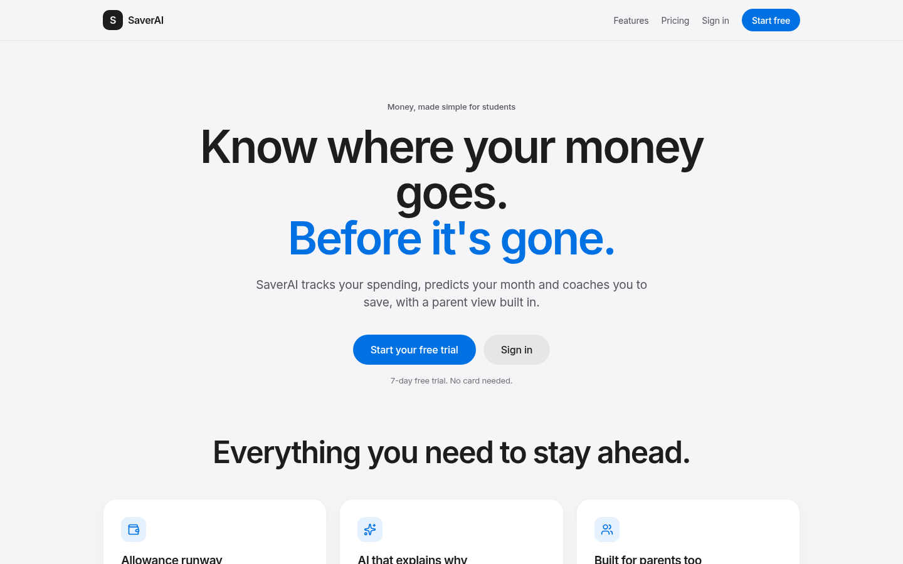
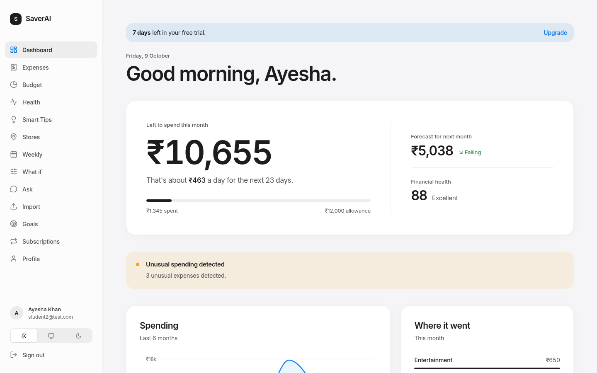
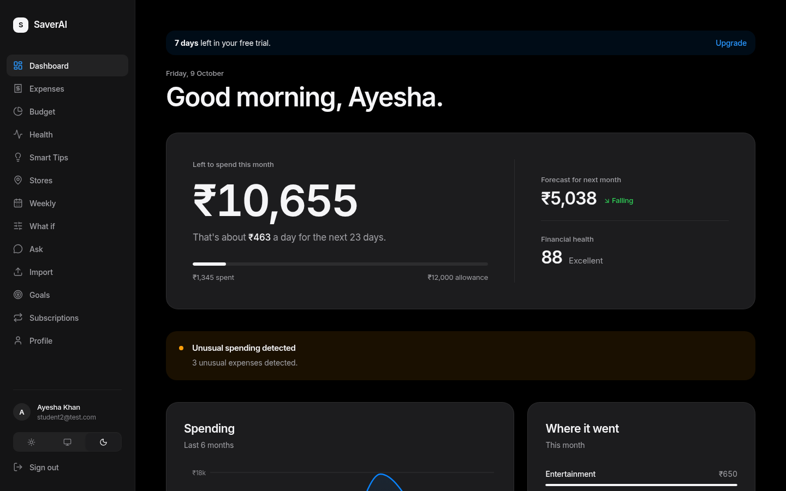
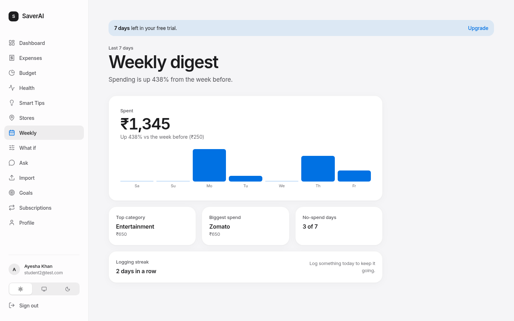
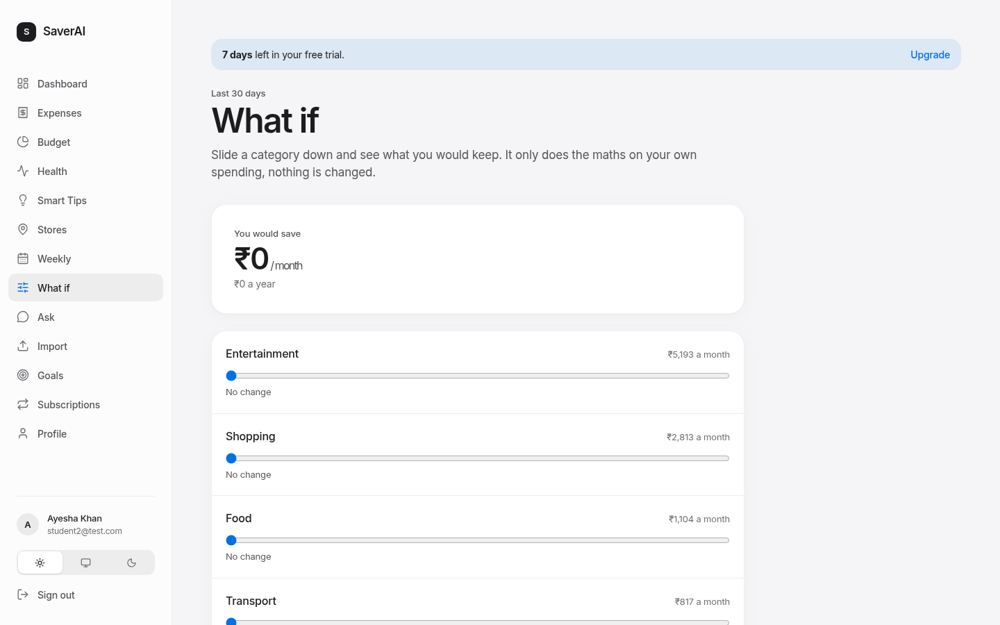
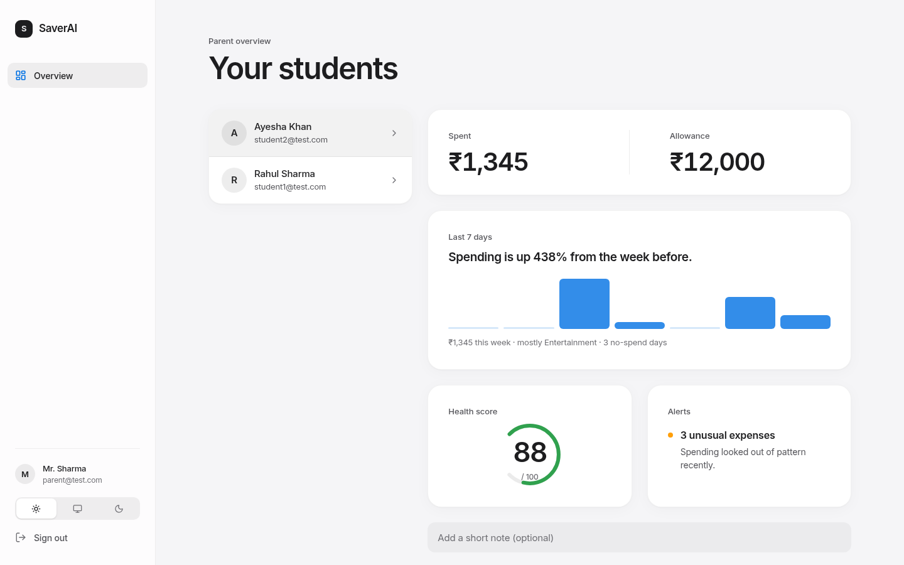

<div align="center">

# SaverAI

**Know where your money goes. Before it's gone.**

The money app for students and the parents who fund them.
Track spending, see how many days your allowance really lasts, and get coached by machine learning that runs on our own servers. No LLMs, no third-party model APIs, no per-user AI bill.

[Features](#what-saverai-does) · [How the AI works](#the-ai-is-ours) · [Plans](#plans) · [Quick start](#quick-start) · [Configuration](#configuration) · [Roadmap](#roadmap)

</div>

---

## Screenshots

Demo data, local build. Light is the default; dark mode follows the system setting.

| Landing | Dashboard |
| --- | --- |
|  |  |
| **Dashboard, dark** | **Weekly digest** |
|  |  |
| **What if simulator** | **Parent view** |
|  |  |

---

## Why SaverAI

Indian students run a monthly allowance on UPI. Existing apps show *what* you spent in pie charts. They do not tell you the one thing that matters on the 12th of the month: **how many days your money lasts and what is about to go wrong.**

SaverAI is built around that moment.

- **Allowance runway.** "You have Rs 12,000 left, about Rs 522 a day for the next 23 days."
- **Parent check-ins.** Parents can send a linked student a friendly allowance reminder by email (one per child every 6 hours, optional note).
- **Weekly digest.** Last 7 days against the 7 before: total, change, a bar per day, top category, biggest spend, no-spend days, and a logging streak. Free for everyone; which subscriptions renew this week is Pro.
- **Parent dashboard.** `GET /api/parent/children` and `/children/<id>/summary` feed the parent overview (spent, allowance, health score, unusual-expense count). These two endpoints were missing from the backend before, so the parent screen showed no students; fixed.
- **Parent weekly view.** `GET /api/parent/children/<id>/weekly` gives a linked parent the shape of their student's week (total, change vs the week before, top category, daily bars, no-spend days). It leaves out the biggest purchase and subscription names on purpose.
- **Ask your parent for extra money.** A student with a linked parent can send one request at a time (amount and a short reason) from the Ask parent page. The parent sees it under "Waiting for you" on their dashboard and taps Approve or Decline. Both get an email. It records the decision only and does not move money.
- **Parent match on savings goals.** A parent can pick a match (25, 50 or 100%) on a student's goal. Every rupee the student saves adds the parent's share to a running "promised so far" figure, shown to both, with an optional cap in the API. It is a promise, not a payment: SaverAI does not move money. `PUT /api/parent/children/<id>/goals/<goal_id>/match`.
- **Receipt scanning (prototype).** `POST /api/expenses/receipt` reads a receipt photo with local Tesseract OCR, finds merchant, total and date, and suggests a category. Nothing is saved and no external API is used. The Add expense dialog has a "Scan a receipt" button (opens the camera on phones) that fills the form for you to check. Needs `tesseract-ocr` on the server; accuracy on real photos is unmeasured. See `docs/RECEIPT_SCANNING.md`.
- **Get started checklist.** New users see a four-step card on the dashboard (allowance, first expense, budget, goal) that ticks off as they do each thing and disappears when done. `GET /api/onboarding`.
- **Upcoming bills.** `GET /api/subscriptions/upcoming` lists detected recurring charges due in the next 14 days (up to 60), shown on the Subscriptions page. Free sees the count and total, Pro sees which ones.
- **Budget pace.** Each budget shows where it will land by month end and the daily spend that keeps you inside. Free for everyone.
- **Teach it once.** Change a wrong category on the Expenses page and SaverAI remembers it for that merchant, for new expenses and statement imports. Your rule beats the model, and you can list and remove rules on the Profile page. Free for everyone.
- **What if.** Slide a category down and see what you would keep each month and year, and how soon that alone fills your nearest goal. Plain arithmetic on your last 30 days. Free for everyone.
- **Ask your money.** "How much did I spend on food this month?" Answered from your own expenses by a small local model (TF-IDF + logistic regression for intent, rules for dates and categories). Period comparisons are Pro. It copes with typos ("how mch did i spnd on fod"), Roman Hindi ("food pe is mahine kitna gaya"), several merchants or categories in one question, explicit dates ("on 5 oct", "in september"), "last 3 transactions", and says plainly when a question is outside spending. It is not a chatbot: it answers questions about your own expenses and nothing else.
- **Bring your bank in.** Upload a CSV statement, SaverAI categorises every payment locally and skips duplicates.
- **Goals with a finish date.** "Headphones: on track for 12 Dec. Save Rs 1,012 a month to hit your date."
- **Coaching, not judging.** Nudges based on your own patterns, flagged unusual spend, cheaper places nearby.
- **Parents in the loop, students in control.** Parents set the allowance and see a summary. Students keep their own data view.
- **Private by design.** Your data is yours. Built with India's DPDP rules in mind, including a draft parental-consent flow for under-18 users (needs legal review, see release checklist).

## What SaverAI does

| | Free | Pro |
|---|:-:|:-:|
| Expense tracking with ML auto-categorization | ✅ | ✅ |
| Budgets with over-budget alerts | ✅ | ✅ |
| Allowance runway (what you can spend per day) | ✅ | ✅ |
| Financial health score (0-100) | ✅ | ✅ |
| Unusual spending alerts (anomaly detection) | ✅ | ✅ |
| Smart tips | 1 a day | All |
| Weekly digest | Full digest, renewal count | Names and dates of renewals this week |
| Subscription finder | Count and monthly cost | Which ones, yearly cost, next renewal |
| Spending forecast | This month's run rate | Next-month ML forecast with confidence range |
| Cheaper nearby store finder | | ✅ |
| Parent link and allowance view | | ✅ |
| Light, Dark and Auto themes | ✅ | ✅ |

Every new account gets a **7-day Pro trial, no card needed**. Prices are placeholders to be validated with real users (Rs 79 a month or Rs 599 a year, set in `frontend/src/config/plans.ts` and `backend/plans.py`).

## The AI is ours

Everything marked "AI" runs locally with classical machine learning. There is no LLM and no external model API key anywhere in this repo.

| Feature | Technique |
|---|---|
| Expense auto-categorization | TF-IDF + calibrated LinearSVC, keyword fallback |
| Unusual spending | Isolation Forest on amount and timing |
| Financial health score | Composite of savings ratio, budget adherence and spending discipline |
| Spending forecast | Regression on monthly history with 95% confidence intervals |
| Subscription detection | Logistic regression over gap regularity, amount stability and cycle fit (weekly, monthly, yearly), trained in-process on synthetic patterns with a fixed seed; a weekly cycle needs at least 3 charges |
| Cheaper stores | Geodesic distance plus price-level model over a store table |

Why this matters for a startup: zero marginal AI cost per user, no data leaves our servers for inference, and the models are ours to improve.

## Architecture

```
React 19 + Vite + TypeScript + Tailwind v4 (PWA)
        |  JWT over HTTPS, React Query
        v
Flask API  ->  SQLAlchemy  ->  SQLite (dev) / PostgreSQL (prod)
   |
   +-- ml/          scikit-learn models (categorizer, anomaly, forecast, subscriptions)
   +-- plans.py     plans, trial and entitlement checks (single source of truth)
   +-- routes/      auth, expenses, budgets, analytics, stores, parent, billing, subscriptions, goals, imports, ask
   +-- APScheduler  daily recommendation job
```

Billing is behind clean seams:

- **Mock mode** (default): no keys needed. Checkout simulates an upgrade so the whole paywall flow works in development. Disabled in production.
- **Live mode**: set the Razorpay variables and checkout creates real subscriptions (UPI Autopay, cards, eMandate). A signed webhook (`POST /api/billing/webhook`, HMAC-SHA256) activates and renews Pro.

## Quick start

Requirements: Python 3.11+, Node 20+.

```bash
git clone https://github.com/naman-sharma12345/saver-ai.git
cd saver-ai

# Backend
cd backend
python -m venv .venv && source .venv/bin/activate
pip install -r requirements.txt
cp .env.example .env            # set JWT_SECRET_KEY at minimum
python seed_db.py               # demo data and trains the categorizer
python run.py                   # http://localhost:5000

# Frontend (new terminal)
cd frontend
npm ci --legacy-peer-deps
VITE_API_URL=http://localhost:5000/api npm run dev   # http://localhost:5173
```

Demo logins after seeding: `student1@test.com` (with a linked parent `parent@test.com`), password `Test@123`. Change or delete these before any real deployment.

Docker (PostgreSQL, migrations run on start):

```bash
export JWT_SECRET_KEY=$(python -c "import secrets; print(secrets.token_hex(32))")
export POSTGRES_PASSWORD=$(python -c "import secrets; print(secrets.token_hex(16))")
docker compose up --build
```

The compose file has not yet been run end to end against a real PostgreSQL in this repo's CI. See the release checklist below before pointing real users at it.

### Release checklist (not done yet)

Merged and tested is not the same as ready for real users. Before launch:

- [ ] Send a real email through SMTP (verification, password reset, guardian consent, parent reminders are only logged until `SMTP_*` is set)
- [ ] Legal review of the Terms, Privacy page and the under-18 consent flow. The DPDP Rules are being phased in and the email-link consent here is a draft, not settled compliance
- [ ] Real Razorpay keys, a live webhook, and a test payment end to end
- [ ] Run the migrations and the app against PostgreSQL and fix anything SQLite hid
- [ ] Rate limits live in process memory. Behind several workers or servers they need a shared store such as Redis
- [ ] Run `flask db upgrade` for the new tables (category rules, extra money requests, goal match). Request emails only log until `SMTP_*` is set
- [ ] Receipt scanning needs the `tesseract-ocr` package in the backend image (not yet in Docker), and real-photo accuracy has not been measured
- [x] Daily scheduler starts in one process only (file lock, so gunicorn workers do not each run it)
- [ ] Rotate the secrets that were committed earlier (old JWT secret and AI key remain in git history)
- [ ] Change or delete the demo logins

### Tests

```bash
cd backend && pytest -q           # API, ML, billing and entitlement tests
cd frontend && npm test && npm run build
```

CI runs both on every push and pull request.

## Configuration

All settings are environment variables (see `backend/.env.example`).

| Variable | Purpose |
|---|---|
| `JWT_SECRET_KEY` | Required in production |
| `DATABASE_URI` | SQLite by default, use PostgreSQL in production |
| `CORS_ORIGINS` | Allowed frontend origins |
| `ADMIN_EMAILS` | Who may retrain the ML model |
| `TRIAL_DAYS` | Free trial length, default 7 |
| `FRONTEND_URL` | Base URL used in emailed links |
| `SMTP_HOST`, `SMTP_PORT`, `SMTP_USER`, `SMTP_PASSWORD`, `MAIL_FROM` | Email for reset and verification links. Empty `SMTP_HOST` only logs emails (development) |
| `RATELIMIT_ENABLED`, `TRUST_PROXY` | Auth rate limits (on by default); set `TRUST_PROXY=1` behind a reverse proxy |
| `SUPABASE_URL`, `SUPABASE_ANON_KEY`, `SUPABASE_JWT_SECRET` | Reserved for a future Supabase auth/db swap, unused today |
| `RAZORPAY_KEY_ID`, `RAZORPAY_KEY_SECRET` | Enable live billing |
| `RAZORPAY_WEBHOOK_SECRET` | Verify Razorpay webhooks |
| `RAZORPAY_PLAN_ID_MONTHLY`, `RAZORPAY_PLAN_ID_YEARLY` | Plans created in the Razorpay dashboard |

Point the Razorpay webhook at `/api/billing/webhook` for `subscription.activated`, `subscription.charged`, `subscription.cancelled`, `subscription.halted`, `subscription.completed`.

## Roadmap

Shipped: Apple-style design system, dark mode, landing page, 7-day trial, paywall and pricing, Razorpay seam, subscription detection, savings goals, DPDP age gate and guardian consent, CSV statement import, Ask your money, auth hardening (rate limits, password reset, email verification), tested API and CI.

Next, roughly in order:

- [x] Savings goals with projected finish dates (free for everyone)
- [x] Auth hardening: rate limiting, password reset, email verification (Supabase swap-in is a documented seam)
- [x] DPDP consent flow and age gate for under-18 users (needs a lawyer's review before launch)
- [x] User-entered expense dates (backdating)
- [ ] Money stored as integer paise
- [x] Bank / UPI statement import (CSV and text-based PDF with a transaction table; scanned PDFs are not supported)
- [ ] Account Aggregator integration for consented bank data (needs a regulated FIU partner, see [docs/ACCOUNT_AGGREGATOR.md](docs/ACCOUNT_AGGREGATOR.md))
- [ ] Receipt scanning
- [x] User-taught category rules
- [x] What-if savings simulator
- [x] Weekly spending digest
- [x] Budget pace warnings
- [x] "Ask your money": plain-English questions answered by our own small intent model, no LLM
- [~] PostgreSQL by default and one-command deploy (config and compose written, not yet verified against a live PostgreSQL)

## Security

- Passwords hashed with bcrypt, 8 character minimum. JWT access and refresh tokens.
- Rate limits on login, register and password reset. Reset links are signed, expire in one hour and work once. The forgot-password endpoint never reveals whether an email has an account.
- Secondary text in light mode meets WCAG AA contrast (4.5:1) and every button and input has an accessible name (checked with a script across the student pages).
- Empty states: a brand-new account no longer shows a made-up forecast (it was another users' average) or a health score; it says what is needed instead. The spending trend chart also shows a short hint instead of an empty axis until there are two months with spending.
- Mobile: checked key pages at 375px wide; the Expenses list no longer overflows the screen and the delete button is always visible on touch devices.
- Request bodies over 6 MB are rejected, statement import is rate limited, and over-long expense fields return a clear 400 instead of a database error.
- Production refuses to start without `JWT_SECRET_KEY`.
- Privacy (India's DPDP Act): date of birth is collected at sign-up. Under-18s cannot use the app until a parent or guardian approves by a signed, 7-day, single-use email link; declining deletes the account. No ads and no marketing tracking. Users can download all their data or delete their account from Profile (`GET /api/auth/export`, `DELETE /api/auth/me`). The in-app Terms and Privacy page is a plain-language draft, not legal advice.
- Model retraining is limited to `ADMIN_EMAILS`.
- Webhooks are accepted only with a valid HMAC signature.
- Found a vulnerability? Please open a private security advisory on GitHub instead of a public issue.

## Research

The market, competitor and monetization research behind these choices is summarised in the project history. Highlights: UPI handles 24 billion transactions a month, Jar reached profitability by moving money rather than charging for tracking, and the median freemium app converts about 2 percent, which is why the free tier here is a real product and not a demo.

## Contributing

Branch from `main`, keep PRs small, run the tests above, and update this README when behaviour changes.

## License

All rights reserved for now. A license will be added before any public release.
