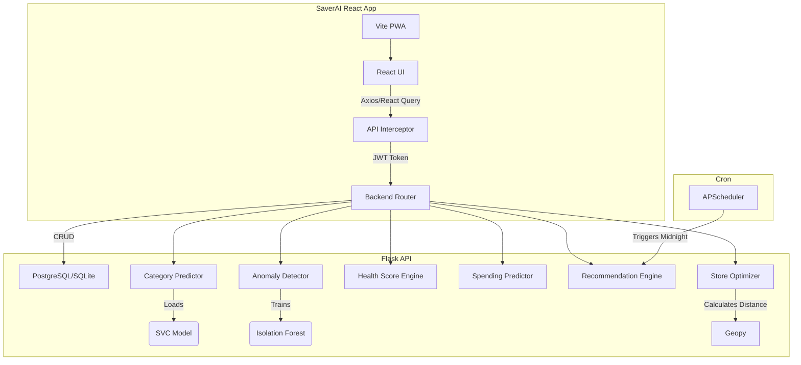

# SaverAI - Student Expense Management & Budget Recommendation System

## Overview
SaverAI is an absolute peak, production-grade, AI-driven financial backend and sleek frontend built for students and their parents. It is designed to act as an intelligent companion that tracks expenses, enforces budgets, detects anomalous spending, and provides real-time, store-specific saving recommendations.

## Features
- **Auto-Categorization:** ML pipeline (TF-IDF + LinearSVC) automatically categorizes incoming expenses with probability calibration.
- **Financial Health Score:** A 0-100 composite score built from Savings Ratio, Budget Adherence, and Spending Discipline (Anomaly Frequency and Coefficient of Variation).
- **Spending Prediction:** Linear regression engine utilizing historical monthly spending to predict future trends with 95% confidence intervals.
- **Store Optimization:** Uses `geopy` to identify nearby cheaper store alternatives for past expenses to project potential savings.
- **Anomaly Detection:** `IsolationForest` detects unusual expenses based on timing and amount, alerting both the student and parent.
- **Parental Oversight:** Read-only parent dashboard to monitor linked children, view their financial health, and send allowance reminders.
- **Modern PWA Frontend:** Built with React, Vite, TailwindCSS (v4), Framer Motion, and Recharts. Includes glassmorphism design, dark/light mode, and mobile optimization.

## High-Level Architecture



## Setup & Execution (Without Docker)

1. **Backend:**
   ```bash
   cd backend
   python -m venv venv
   source venv/Scripts/activate # Windows
   pip install -r requirements.txt
   
   # Initialize and seed database (Also trains ML models!)
   flask db upgrade
   python seed_db.py
   
   # Run server
   python run.py
   ```

2. **Frontend:**
   ```bash
   cd frontend
   npm install
   npm run dev
   ```

## Setup & Execution (With Docker)

To run the entire application stack using Docker Compose:

```bash
docker-compose up --build
```
- Frontend will be accessible at `http://localhost:80`
- Backend API will be accessible at `http://localhost:5000`

## Documentation & Testing
- **Postman:** Import the `AI_Expense_Manager.postman_collection.json` file.
- **Tests:** Run `pytest tests/ -v` inside the backend directory (37+ tests). Run `npm run test` inside the frontend directory for component tests.

